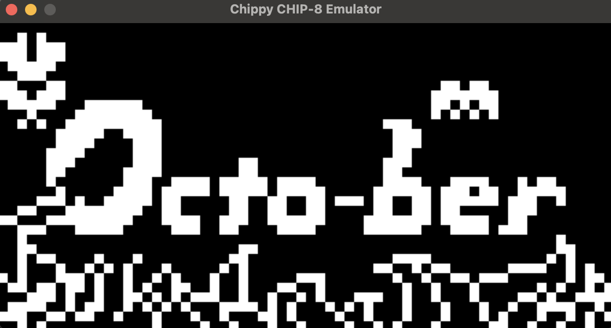

## Chippy CHIP-8 Emulator


A CHIP-8 emulator written in C. This project allows you to play classic CHIP-8 programs and serves as an educational tool for learning about emulation and low-level systems programming.

#### Introduction
CHIP-8 is a simple, interpreted programming language created in the 1970s to run on 8-bit microcomputers. It is often used as an introduction to emulation because of its simplicity and small set of instructions.

This emulator supports the CHIP-8 instruction set and can load and run CHIP-8 programs, allowing you to experience classic programs from the era.

#### Installation
Make sure you have gcc and SDL2 installed.

#### Build Instructions
Clone this repository:

```bash
git clone https://github.com/mindwrapped/chippy-chip8-emulator.git
cd chippy-chip8-emulator
make
```
#### Usage
To run a CHIP-8 ROM, simply pass the ROM file as an argument when executing the emulator:

```bash
./chip8 path_to_rom
```
#### Contributing
Contributions are welcome! Please follow these steps:

Fork the repository.
Create a new branch (git checkout -b feature-branch).
Commit your changes (git commit -m 'Add some feature').
Push to the branch (git push origin feature-branch).
Open a Pull Request.

This project is licensed under the MIT License - see the LICENSE file for details.
